# Hello there :hello:

I do some buttons that run some stuff and deploy things somewhere ???

<h1 align="center" style="color:text-shadow: black 0.1em 0.1em 0.2em;">Signature key :closed_lock_with_key:</h1>

<h1 align="center" style="text-shadow: black 0.1em 0.1em 0.2em;">GitHub Stats</h1>

  
  
  
  
  
  

